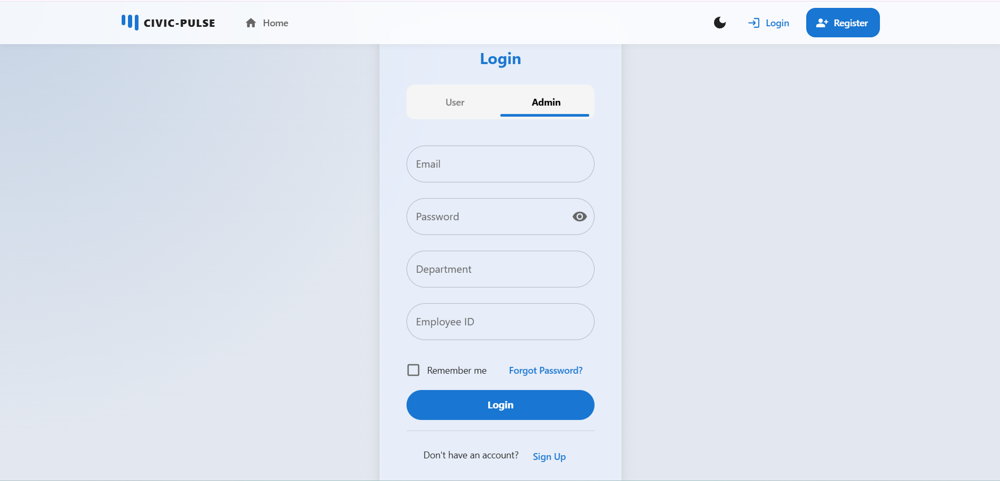
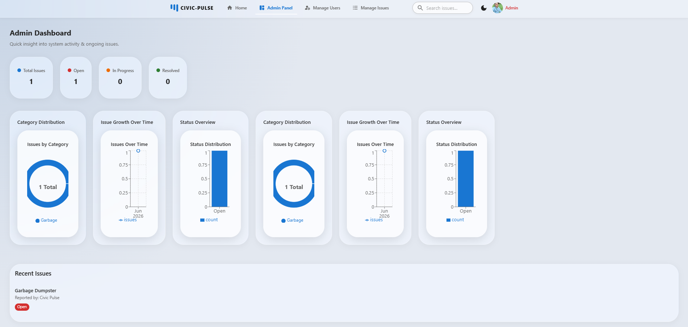
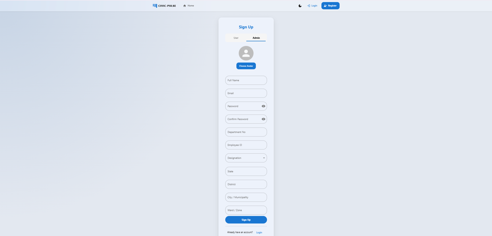
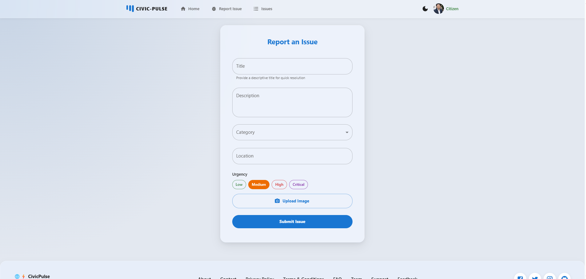
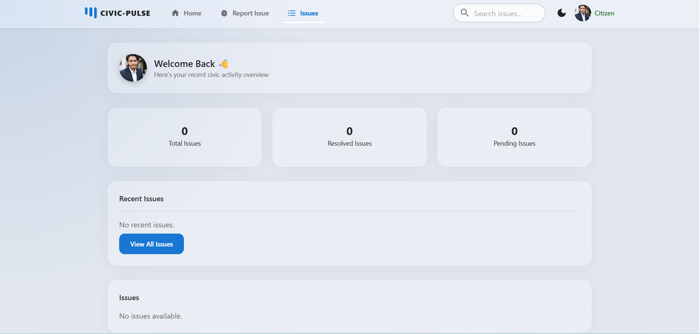

# CivicPulse

Project Overview

- CivicPulse is a React + Node.js application for civic issue reporting and user management.
- Backend: Express + MongoDB (local or Atlas).
- Frontend: React with Material UI/Bootstrap components for authentication, issue reporting, dashboard and admin features.

Features

- User registration with avatar upload and email verification
- Login with access/refresh tokens (cookies)
- Protected routes for profile, issue management and admin actions
- Password reset flow (email link + expiry)
- Role based access (user, staff, admin)
- Avatar upload via Cloudinary
- Email notifications (verification, reset) via SMTP transporter

Tech Stack

- Frontend: React, MUI, React Router, Framer Motion, Bootstrap (select components)
- Backend: Node.js, Express, Mongoose, JWT, bcrypt
- Database: MongoDB (local or Atlas)
- File storage: Cloudinary
- Email: Nodemailer (SMTP)
- Dev OS: Windows (tested in VS Code)

Architecture

- Client (client/) — React SPA, calls backend API endpoints, includes pages for auth, issues, dashboard.
- Server (server/) — Express app exposing /auth, /api/issues, /api/dashboard, /civicPulse/v1/users routes.
- Auth uses cookie-based access and refresh tokens; CORS configured to allow the frontend origin and credentials.
- Tokens generated per-user and stored hashed in DB where applicable; refresh token persisted in user doc.

## Screenshots

Screenshots are included in the repository at: /client/src/assets/screenshots

Example markdown to display one of these images:

Installation (Windows)

1. Clone repository and open workspace:
   - git clone <repo-url>
   - cd "d:\React\College Mini Project\civicpulse"
2. Open two PowerShell terminals (one for server, one for client).
3. Server:
   - cd server
   - npm install
   - copy .env.example to .env and fill values
   - npm run dev (or npm start depending on scripts)
4. Client:
   - cd client
   - npm install
   - npm start
5. Ensure frontend origin (e.g. http://localhost:3000 or 5173) matches server CORS origin and frontend uses credentials: 'include' for cookie requests.

Environment Variables

- NODE_ENV (development|production)
- PORT (server port)
- MONGO_URI (mongodb connection string, local or Atlas)
- FRONTEND_URL (frontend base URL, e.g. http://localhost:3000)
- ACCESSTOKEN_SECRET (JWT secret for access tokens)
- REFRESHTOKEN_SECRET (JWT secret for refresh tokens)
- SMTP_HOST, SMTP_PORT, SMTP_USER, SMTP_PASS, SMTP_FROM (email transporter)
- CLOUDINARY_CLOUD_NAME, CLOUDINARY_API_KEY, CLOUDINARY_API_SECRET (Cloudinary)
- Any other variables referenced in server/.env.example

Notes / Common Pitfalls

- Cookies with SameSite=None require Secure=true and HTTPS. For local dev, use sameSite: 'lax' and secure: false; ensure NODE_ENV !== 'production' locally.
- CORS: must set origin to exact frontend URL and credentials: true.
- Frontend API calls that rely on cookies must use fetch/axios with credentials: 'include' (or withCredentials: true).
- Verify email flow: frontend verify page should POST { token } to backend /auth/verify-email (or the server can accept token via query as a fallback).

Future Enhancements

- Add HTTPS support for local dev (mkcert) to allow SameSite=None + Secure cookies.
- Implement rate limiting and brute-force protection for auth endpoints.
- Add email token expiry and audit logs for security events.
- Improve UI/UX and accessibility; add tests (unit/integration).
- Add admin analytics and real-time notifications (WebSockets).
